# 内存映射原理（分页机制）

## 目录

- 原理
- 代码
- bochs 映射演示
- 缺页演示

## 内存管理机制

- 分段
  - 内存描述符
  - 平坦模型: 只分一个段，也就是不分段
- 分页: 4kb

---

**内存映射机制图**如下


给到一个内存地址，根据内存的虚拟地址去进行划分从不同的目录去找对应的页内容。
页目录储存在cr3寄存器中，然后类似点燃的效果，一层层去找对应的数据

---

- 逻辑地址: 程序访问的地址
- 线性地址: 程序访问的地址 + 描述符中的基地址
- 物理地址: 实际存储的地址 实际的物理页
- 虚拟地址: 虚拟内存的地址

平坦模型中，逻辑地址和线性地址是相同的

内存映射是将线性地址转换为物理地址的过程
就是将一个逻辑地址，根据不同的拆分方式找到实际在内存中的数据的存储页

---

## 内存分页

- 进程内存空间：程序员在编写程序的时候不知道具体运行的机器

    也就是说，对于程序员来说，他编写代码所使用的内存都是同一片内存，只有在进行编译链接的时候才会对应放入不同的内存块中，但是这些对程序员来说都是透明的
- 虚拟内存：可以使用硬盘来模拟内存

由于一页内存是 4KB 32位总共可以访问 4G 的内存，所以将内存分成了 4G / 4K = 1M 个页 也就是2的20次方

现在要做线性地址和物理地址的一一映射关系，这个映射关系存储在内存中，由于系统中没有 20bit 的数据结构，就用32bit 的数据结构去进行存储

```c
u32 page_table[1 << 20];

```

其中 1 << 20 就是 1M，总共是 1M 个页，一页占 4B 的内存，也就是 32 位的一个寻址数量，这个是因为在 x86 中 只有 32 条总线可以去寻址和存取数据。这个数组大小是 4M 这个数组就是页表

这个数组也存储在内存中，4M = 1024 * 4K 就是需要占用 1024 个页去存储这个页表

每个进程都需要一个页表来映射内存，如果使用这个方式的话，每个进程都需要至少 4M 的内存去存储页表，但不是所有的进程都可以使用 4G 的内存，所以需要引入页目录，用来表示这 1024 个页，用到了哪些页，放入了页目录中，在需要页表的信息时先从页目录中去找，如果没有的话就发生缺页中断。一页页表用 4B 表示，就是可以通过 32 条总线去找到这个页表所在内存的位置。

如果进程只用到很少的内存的话，就可以只用两个页来表示，这也可以表示 4M的内存，一页页目录，一页页表，总共用到 8K ，比起 4M 的内存，少了很多。如果使用全部 4G 的内存空间的话，也只会刚好占满页目录。一般进程无法占满。

恰好是有意设计的， 因为页的大小是 4KB 

在内存中，包括内核和页目录一些比较重要的页会在启动电脑时被常驻内存，一页 用 20bit 来表示却用了 32bit
剩下 12 bit 用来表示其他信息 表示该页内存的属性属性如下

页**表**


- 页表是分页机制的第二层结构，负责将虚拟地址映射到物理地址。

页**目录**

- 一个包含页表指针的数组，每一个页目录条目指向一个页表，页表指向实际的物理内存页


```cpp
typedef struct page_entry_t
{
    u8 present : 1;// 是否在内存中
    u8 write : 1;// 0 可读，1 可读可写
    u8 user :1 ;// 1 所有人 0  超级用户 DPL < 3
    u8 pwt : 1;// page write through 1 直写模式，0 回写模式  快表：将页表缓存到了块表之中，在发生缺页中断时，可以更快的找到页表。
    // 直写模式 写入源数据和cache 中，回写模式 只写入cache
    u8 pcd: 1;//page cache disable 禁止此页缓冲，意味着只能从内存中读取
    u8 accessed: 1;//是否被访问过，用于统计使用频率，在发生缺页中断时参与选择页去加载到内存
    u8 dirty :1;//脏页，表示该页缓冲被写过
    u8 pat: 1; // page attribute table 页大小 4M/4K
    u8 global :1;// 全局，所有进程都用到，该页不刷新缓冲
    u8 ignored : 3;//没有什么用处
    u32 index: 20;// 索引
}_packed page_entry_t;
```

有意构造这个结构体刚好占 4 个字节

```c
page_entry_t page_table[1024];

```

## 内存映射

---
**CRC**寄存器Control Register


---

控制寄存器

 1. 先准备一个页目录
 2. 将要映射的地址写入页表，将页表写入页目录
 3. 将页目录写入 cr3 寄存器
 4. 将 cr0 最高位(PG) 置为1 启用分页机制，最低位是用来启用保护模式的标志位

---

## Onix 实践

映射完成之后，低端 1M 的内存要映射到原来的位置，因为内核放在那里，映射完成之后可以继续执行

```c
//获取 cr3 寄存器
u32 get_cr3();
// 设置 cr3 寄存器，参数是页目录的地址
void set_cr3(u32  pde);
// 将 cr3 寄存器的最高位 PG 置为 1 ，启用分页
static void enable_page();
 
```

- 如何在分页启用时，修改 页目录和页表
