# 内核内存映射

## 目录

- 内存映射
- bochs映射

---

``` c++
// 将最后一个页表指向页目录自己，方便修改
// 不过，会浪费掉最后 4m 的线性地址空间，只用来管理页表
page_entry_t * entry = &pde[1023];
entry_init(entry,IDX(KERNAL_PAGE_DIR))
```

将前 8M 的内存映射到，自己原来的位置，供内核使用


映射完成后的页面分布
页表存在内核空间中


目的 将虚拟地址linear address和物理地址 physical address对应。